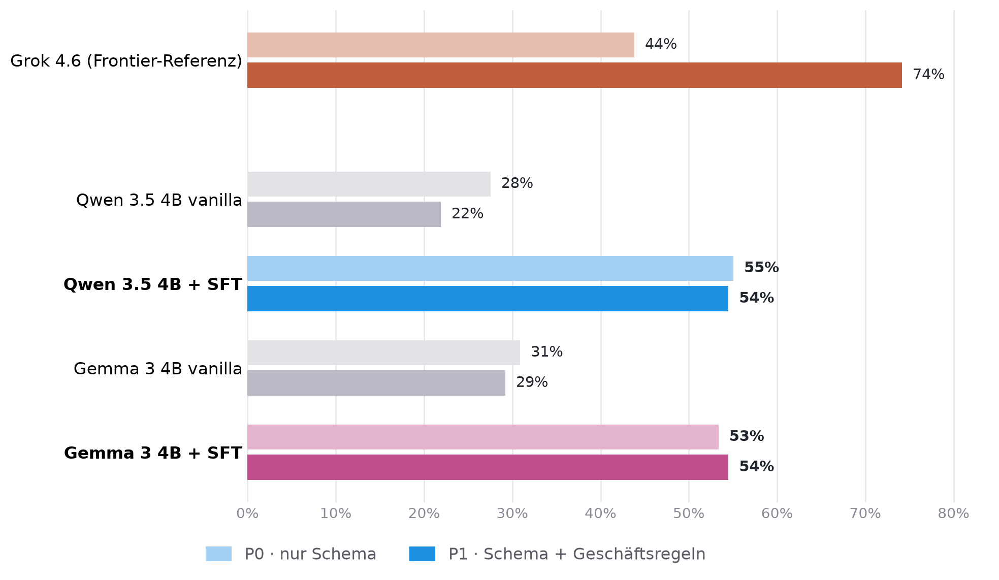
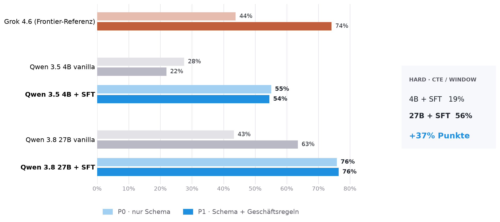

# Text-to-SQL with Small Language Models

Reproducibility material for the talk on fine-tuning small language models (SLMs) for a German Text-to-SQL task.

This repository contains the frozen training datasets, evaluation records, seed database, code, and figures behind the reported comparisons. It is a compact research artifact, not a production Text-to-SQL system or a general-purpose training framework.

## What is included

- A synthetic e-commerce schema and seed data.
- Two curated supervised fine-tuning (SFT) datasets:
  - **v4** — 1,022 examples.
  - **v4.1** — 921 examples; a repetition-reduced variant of v4.
- Frozen, scored evaluation records for the model and prompting conditions shown in the talk.
- The two published figures, their plotting code, and local dataset-validation utilities.
- Minimal, self-contained training-image definitions for Gemma 4 E4B, Qwen 3.5 4B, and Qwen 3.8 27B.
- Dataset manifests with counts, curation provenance, and SHA-256 hashes.

## Results at a glance

The figures compare execution-equivalence accuracy for two prompt conditions:

- **P0:** schema context only.
- **P1:** schema context plus business rules / glossary.

The released scored records cover these model runs, each with `p0.jsonl` and `p1.jsonl`:

| Family | Run | SFT dataset |
| --- | --- | --- |
| Frontier reference | Grok 4.6, low reasoning | — |
| Qwen 3.5 4B | vanilla | — |
| Qwen 3.5 4B | SFT | v4.1 |
| Gemma 4 E4B | vanilla | — |
| Gemma 4 E4B | SFT | v4 |
| Qwen 3.8 27B | vanilla, Q4 | — |
| Qwen 3.8 27B | SFT, r16 | v4.1 |

## Published figures

### Fine-tuned 4B models versus the frontier reference



### Qwen scaling: 4B versus 27B



## Repository layout

```text
.
├── data/
│   ├── evaluation/       # Eval set, schema contexts, prompts, and specifications
│   ├── sql_seed/         # Synthetic e-commerce schema and CSV seed data
│   └── training/
│       ├── v4/           # Final SFT-v4 candidates, messages, and manifest
│       └── v4.1/         # Final SFT-v4.1 candidates, messages, and manifest
├── results/
│   ├── evaluation_v2_silver/  # Frozen scored records: one P0/P1 pair per run
│   └── figures/               # Figures used in the talk
├── src/                   # Dataset construction, validation, analysis, and plotting code
└── training/              # Minimal Docker build contexts and SFT code per model family
```

## Fine-tuning material

`training/` contains the code required to build the training images and run QLoRA SFT for the three model families represented in the results. Each model-specific directory contains its Dockerfile, pinned or declared Python dependencies, training entrypoint, training script, and build-time preflight checks. The Gemma and Qwen 3.5 images also include the evaluation modules required by their Dockerfiles.

It deliberately excludes cloud-build definitions, deployment/submit scripts, cloud-run environment files, concrete resource identifiers, container image references, and trained adapter weights. Those are deployment-specific rather than necessary to inspect or reproduce the training recipe.

## Data and evaluation records

All released task material is synthetic: the e-commerce schema, seed data, and SFT examples do not contain production customer data. The final SFT datasets are provided in two forms:

- `candidates.jsonl` contains the reviewed German question, reference SQL, metadata, and provenance fields.
- `messages.jsonl` contains the rendered chat records used for SFT.

Each `manifest.json` records the selected-example count and a SHA-256 digest of the candidate dataset. The evaluation files are immutable scored JSONL records. They retain the generated SQL and the execution-based `result_equivalent` judgment used for the reported accuracy.

## Scope of reproduction

The repository supports inspection and independent recalculation of the published results from the frozen artifacts. Regenerating the exact model outputs is intentionally out of scope: it would require access to the relevant model versions, inference infrastructure, and—in some cases—paid or proprietary services. Fine-tuning is also hardware- and configuration-dependent.

The included plotting scripts read directly from `results/evaluation_v2_silver/` and write regenerated figures to `results/figures/reproduced_*.png`. The remaining local utilities build, validate, and analyse the released datasets; online model inference and execution scoring are intentionally not part of this compact release.

## Related material

The earlier SLM fine-tuning talk and its separate reproducibility repository are available at [Buchhold/slm_finetuning_talk](https://github.com/Buchhold/slm_finetuning_talk).

## License

This repository is released under the [MIT License](LICENSE). Attribution is appreciated but not required.